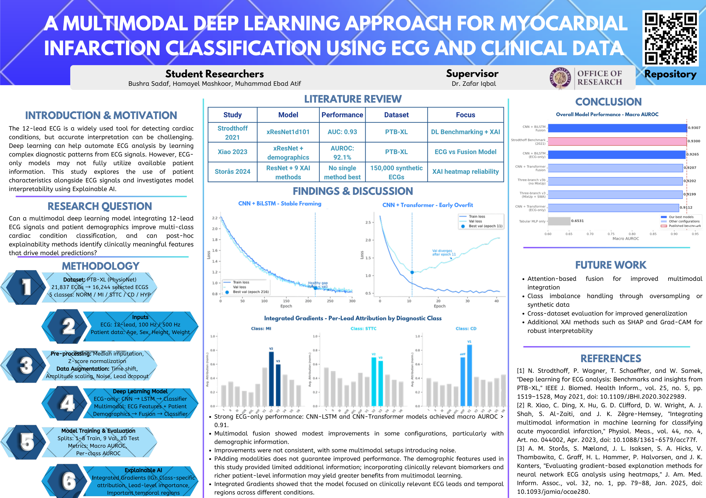

# Multimodal and Explainable Deep Learning for Cardiac Condition Classification on PTB-XL

Summer research project at Habib University, supervised by **Dr. Zafar Iqbal** through the Office of Research.

This repository builds a diagnostic classifier for 12 lead electrocardiograms that combines two very different kinds of evidence: the raw electrical signal from the heart, and the patient metadata that sits alongside it. It then asks a second question of the resulting model: not just *how well* does it classify, but *why* does it decide what it decides, and does that reasoning hold up against what a cardiologist would expect. Every component here was written from scratch in PyTorch rather than assembled from prebuilt pipelines, because the point was to understand each piece, not just run it.

**Student researchers:** Muhammad Ebad Atif, Bushra Sadaf, Hamayel Mashkoor, 
**Supervisor:** Dr. Zafar Iqbal, Office of Research

---

## Poster



The poster above summarizes the project as presented at the progress check-in. It predates the full explainability writeup below; this README is the fuller, living account.

---

## What this project is asking

An ECG carries the actual electrical fingerprint of an infarction. A patient's age and sex carry something quite different: population level risk. Neither is the whole picture. The question driving this work is whether combining them in one model beats either one alone, where the gain comes from, and — once a model is trained — whether it is actually using the evidence a clinician would trust it to use.

The dataset is [PTB-XL](https://physionet.org/content/ptb-xl/), 21,799 clinical 12 lead recordings with expert SCP code annotations, patient demographics, and a prebuilt stratified fold assignment that keeps every patient inside a single fold.

---

## Results

### Binary task: MI versus Normal

| Model | Input | Test AUROC |
|---|---|---|
| 1D CNN | 12 lead signal | **0.972** |
| MLP | age, sex | 0.798 |

The gap here is the finding. Demographics carry a real signal (MI incidence climbs steeply with age, and 0.798 is well clear of chance), but they cannot diagnose a specific infarction. That evidence lives in the waveform. The two models are wrong in different ways, which is exactly the precondition that makes fusing them worth doing.

### Five class task: NORM / MI / STTC / CD / HYP — final comparison across all architectures explored

| Model | Macro AUROC |
|---|---|
| CNN + BiLSTM fusion | **0.9307** |
| Strodthoff et al. 2021 benchmark (published) | 0.9300 |
| CNN + BiLSTM (ECG-only) | 0.9265 |
| CNN + Transformer fusion | 0.9207 |
| Three-branch fusion v3b (no MixUp) | 0.9202 |
| Three-branch fusion v3 (MixUp + SWA) | 0.9199 |
| CNN + Transformer (ECG-only) | 0.9112 |
| Tabular MLP only (demographics, no signal) | 0.6531 |

The best fusion model edges past the published benchmark, and every ECG-containing model clears 0.91. The tabular-only model at 0.6531 is the useful reference point for the rest of this README: it is well above chance (0.5) but far below any model that sees the signal, meaning demographics alone are a weak classifier — which is exactly the tension the Explainable AI section below investigates. Does a fusion model that scores 0.93 actually use those weak-on-their-own demographic features, or ignore them?

### Per class breakdown — CNN + Transformer fusion (Week 5)

| Class | AUROC |
|---|---|
| NORM | 0.8958 |
| MI | 0.9075 |
| STTC | 0.9302 |
| CD | 0.9020 |
| HYP | 0.9337 |

### Class distribution after single label filtering (Weeks 4–7)

| Class | Count |
|---|---|
| NORM | 9,069 |
| MI | 2,532 |
| STTC | 2,400 |
| CD | 1,708 |
| HYP | 535 |

Roughly 17:1 between the largest and smallest class. HYP is the one to watch: with only 535 records total, its test fold holds around 53 examples, which makes its AUROC the least stable number in the table. Class weighting via `compute_class_weight('balanced', ...)` gives HYP roughly six times the weight of a NORM example, which is what stops the model from ignoring it entirely. Week 8's multi-label reformulation uses `pos_weight` in `BCEWithLogitsLoss` for the same purpose.

---

## Explainable AI — the current core of this project

> A model that scores 0.93 AUROC but cannot explain itself is hard to trust clinically. This is the largest, most involved, and currently most active phase of the project: applying **Integrated Gradients (IG)** to the frozen, best-performing models to determine which ECG leads and time regions drove each prediction, whether that lines up with known clinical signatures, and whether the fusion model's demographic branch is actually contributing or just along for the ride.

Full working log, including every intermediate dead end and correction: **`XAI_LOG.md`**. Method background and the reference paper this is built on: **`paper_notes_time_reversal_xai.md`**.

### Method

Integrated Gradients attributes a prediction to each input feature by integrating the model's gradient along a straight path from a baseline input (a flat, zero signal) to the actual recording, then weighting by how far that feature moved from baseline. Unlike plain gradients, IG does not go blind when a feature has saturated the model's response, and it satisfies *completeness* — attributions sum exactly to the change in prediction from baseline to input. The multi-class extension (attributing separately per class via captum's `target` argument, since PTB-XL's five superclasses are not mutually exclusive the way the reference paper's binary setup was) is one genuine extension beyond the reference methodology.

Analysis ran on two frozen models:

- **Week 7 CNN+BiLSTM fusion** (signal + demographics, single-label, softmax) — `week9_xai.py`
- **Week 8v2 three-modal fusion** (signal + FFT + demographics, multi-label, sigmoid) — `week9_xai_fusion.py`. The FFT branch is computed internally via `torch.fft.rfft` inside `forward`, so at the input level captum only sees signal and tabular; the two genuinely separable inputs for attribution are signal and demographics.

The reference methodology is Iqbal et al. 2025, *Explainable Self-Supervised Dynamic Neuroimaging Using Time Reversal* — the supervisor's own prior work, applying the same IG methodology to fMRI instead of ECG.

### Two confounds, found and corrected

Raw saliency maps were dominated by two architectural artifacts that had nothing to do with cardiology, and separating them from real signal was most of the actual analysis work:

| Confound | Cause | Fix |
|---|---|---|
| Strip-edge saliency | Both models read out from the BiLSTM's *terminal* hidden states (forward direction's last time step, backward direction's first time step), anchoring the gradient at the two ends of the 10-second strip regardless of class | exclude a margin from both ends before locating salient time windows |
| Dominant-lead effect | The same one or two leads (V2, II) topped every class's ranking — global signal energy, not class-specific attention | subtract the across-class mean lead profile to reveal each class's elevation *above* baseline |

A direct consequence of the strip-edge confound: **neither model's temporal attention is clinically phase-localizable** (no defensible "the model focused on the ST segment" claim). This is stated as an architecture limitation, not hidden. The fix, if temporal localization is wanted later, is attention pooling over all time steps instead of a terminal-state readout — exactly what the reference paper's own architecture does.

### What survives, once corrected

| Class | Top leads (elevation above global baseline) | Clinical read |
|---|---|---|
| NORM | negative across the board (no lead elevated) | correct — no dominant pathological region is exactly the NORM signature |
| MI | V2, III/aVF (anterior + inferior) | correct — the two most common MI territories |
| STTC | V5, V6 (fusion model) / limb leads (CNN+BiLSTM) | plausible; fusion model localizes better |
| CD | V1 (strongest single elevation of any class) | correct — V1 is the primary bundle-branch-block reading lead |
| HYP | V5, V6 | correct — the standard LVH voltage leads |

The fusion model's lead-level attention is sharper than the CNN+BiLSTM's across the board, which means the better-performing model is also the more clinically grounded one — not a foregone conclusion, and worth stating plainly.

### Does the model actually use demographics?

This is the sharpest result of the phase, and it speaks directly to the tabular-only 0.6531 AUROC in the results table above. Attributing both the signal and demographic inputs on the fusion model and comparing per-element attribution:

| Class | Demographics' share of total attribution | Per-element attribution ratio (demo : signal) |
|---|---|---|
| NORM | 4.87% | ~154x |
| MI | 1.28% | ~39x |
| STTC | 0.90% | ~27x |
| CD | 1.04% | ~31x |
| HYP | 0.90% | ~27x |

Demographics is 4 features against the signal's 12,000, so an *equal* per-feature contribution would show up as roughly 0.03% share. It instead gets **27x to 154x** that, heaviest for NORM. The model is demonstrably not ignoring demographics — a direct, quantitative answer to whether demographic fusion is worth the added complexity, rather than an argument made only from the AUROC delta.

### The open question — current top priority

**Attribution shows the model attends to demographics, it does not by itself prove demographics improves accuracy.** Those are different claims, and closing that gap is the active next step: a demographics-zeroed ablation, comparing per-class AUROC with the tabular branch zeroed out against the full model. Written and queued in `week9_xai_fusion.py`, final cell. This is the single most important unfinished piece of the project right now.

---

## Three findings worth reading (from the earlier binary/5-class phase)

### 1. The STEMI versus NSTEMI split is not possible on this dataset

The project originally aimed at a three class scheme: Normal, STEMI, NSTEMI. That distinction is clinically real and rests entirely on one question, whether ST elevation is present. PTB-XL has an `STE_` code for exactly that.

It appears in **9 records out of 21,799, and its value is 0.0 in every single one.** Not a single recording in the dataset confidently affirms ST elevation.

The obvious fallback, `infarction_stadium1`, does not rescue it either. That field encodes the *healing stage* of an infarction (Stadium I, II, III, meaning roughly how long ago it happened), not whether ST elevation was present at the time. Timing and morphology are different axes. Dressing one up as the other would have produced class names that quietly lied about what the labels meant.

So the task was redefined as binary MI versus Normal, which the SCP codes genuinely support. Discovering that a labeling scheme is infeasible and proposing an honest alternative is the actual work of label engineering.

### 2. Building the MI code set from the codebook, not from memory

An early version hardcoded nine MI codes by hand. Pulling them from `scp_statements.csv` instead reveals **fourteen**, including five `INJ*` injury pattern codes (`INJAS`, `INJAL`, `INJIN`, `INJIL`, `INJLA`) that a hand written list silently misses. Any recording whose only MI finding was an injury code would have been mislabeled.

```python
mi_codes = set(scp[(scp['diagnostic'] == 1) & (scp['diagnostic_class'] == 'MI')].index)
```

Ask the codebook. Do not trust recall.

### 3. Comparison against published work is indicative, not head to head

The reference benchmark for PTB-XL is Strodthoff et al. 2021, which reports roughly 0.93 macro AUROC for the strongest single models (`resnet1d_wang` 0.930, `xresnet1d101` 0.928), all of which edge out LSTM based approaches (0.921 to 0.927).

But that benchmark is **multi label**: it keeps recordings carrying several concurrent superclasses and predicts each independently with per class sigmoids. Weeks 4 through 7 of this project were **single label**: multi label recordings were discarded so that softmax over mutually exclusive classes is valid, leaving 16,244 of 21,799 records. Week 8 onward switched to a genuinely multi-label formulation (`BCEWithLogitsLoss`, sigmoid per class), which is directly comparable to Strodthoff's setup — part of why the Week 8v2 numbers are the most defensible ones to compare against the published benchmark.

Same dataset, same folds, same metric. Where the task formulation differs, it's called out rather than glossed over.

---

## Architectures

**Signal encoder (Weeks 4–7).** Three convolutional blocks (32 → 64 → 128 channels, kernels 7 → 5 → 3, padding `k//2` so only pooling changes length). Input is `(12, 1000)`, twelve leads at 100 Hz. Because the first convolution spans all twelve leads at once, a single filter can learn cross lead signatures from layer one, which matters because an infarction shows itself in whichever leads view the damaged wall.

**Sequence readers.** The CNN compresses the signal to a 250 step sequence of 128 dimensional features. Two readers were built on top of it:

- **BiLSTM**, hidden size 128 (Week 6) or 64 (Week 7's leaner variant), bidirectional, giving a 256 or 128 dimensional embedding from both directions' final hidden states. Bidirectional is defensible here because the full ten second recording is available offline, and ECG features depend on context from both sides. This terminal-state readout is also the direct cause of the strip-edge saliency artifact documented above.
- **Transformer encoder**, `d_model=128`, 8 attention heads, with a learnable positional embedding (attention is order blind, so position has to be injected) and mean pooling across time to a 128 dimensional embedding.

**Three-modal fusion (Week 8).** A third, frequency-domain branch is added: the signal's FFT magnitude (`torch.fft.rfft`, log-compressed) is passed through its own small Inception-style block and pooled, so the model reasons over both time-domain and frequency-domain representations of the same signal. Week 8v2 shrinks the backbone (Inception 32/64 instead of 64/128, LSTM hidden 32 instead of 64) and adds MixUp (blending pairs of samples and their soft labels to resist memorization), DropPath (randomly skipping entire Inception blocks during training, stochastic depth), and gradient clipping, aimed at pushing stable convergence past 150 epochs without the model just memorizing a dataset this size.

**Tabular encoder.** Age, sex, height, weight. Height is missing in roughly 68% of records and weight in 57%, handled with median imputation fit on the training split only. Kept deliberately small, because four features do not support a large network — which makes the Explainable AI finding that these four features still carry 27x to 154x their dimensional share of attribution more striking, not less.

**Fusion.** Intermediate fusion throughout: each encoder produces its own embedding, the embeddings are concatenated, and a joint classifier head learns from all of them together. The signal-plus-tabular models (Weeks 6–7) were also trained by transfer (chopping the heads off pretrained encoders with `nn.Identity()` and fine tuning at a lower learning rate) in addition to from-scratch.

---

## What the loss curves said

The Transformer fusion model overfits noticeably harder than the BiLSTM version. Training loss falls smoothly to about 0.15 while validation loss climbs past 2.5 by epoch 30. This is consistent with a Transformer having less built in inductive bias for sequential structure than an LSTM, so on a dataset of this size it memorizes rather than generalizes. The CNN+BiLSTM's healthier curve (train and validation both falling and staying close, no divergence) across 300 epochs is a large part of why it remains the strongest single model in the final comparison table.

Best validation checkpointing is what saves the reported numbers throughout the project. The evaluated model comes from whichever epoch had the lowest validation loss, not from the final epoch — most visible in the Transformer's case, where the last epoch would have been a badly overfit model.

---

## Repository layout

```
week2.py               PTB-XL exploration: 12 lead visualization, superclass distribution, NORM versus MI
week3.py                Binary MI versus Normal: label engineering, 1D CNN, tabular MLP
week4.py                Five class multimodal: single label extraction, CNN+BiLSTM, four feature MLP, fusion
week5.py                Transformer encoder, benchmark comparison, Inception and residual backbone
week6/7 *.py            CNN+BiLSTM fusion refinement (hidden size, augmentation), Transformer fusion comparison
week8*.py                Three-modal fusion (signal + FFT + demographics), multi-label BCE, v1/v2/v3 iterations
week9_xai.py             Integrated Gradients on the frozen Week 7 CNN+BiLSTM fusion model
week9_xai_fusion.py      Integrated Gradients + modality contribution + ablation on the frozen Week 8v2 fusion model
XAI_LOG.md                Full working log for the explainability phase: theory, method, every dead end and fix
PROJECT_LOG.md           Primary training log, updated after every week; per-model per-class breakdowns
paper_notes_time_reversal_xai.md   Detailed notes on the reference XAI paper (Iqbal et al. 2025)
```

Each week's script is a self contained `# %%` notebook that runs top to bottom. They hand off through files on disk rather than shared memory, so any one can be run alone once the ones before it have run once.

Signals are cached to `./cache/*.npy` after the first load. Reading thousands of WFDB files takes several minutes; reading the cache takes a second. The multi-label pipeline (Week 8 onward) uses a separate `ml_X_*.npy` cache since it keeps a different, larger set of recordings than the single-label pipeline.

---

## Methodology notes

**Patient safe splitting is not optional.** PTB-XL ships a `strat_fold` column assigning every recording to one of ten folds, with all of a given patient's recordings sharing a fold and each fold preserving the overall class balance. Folds 1 to 8 train, fold 9 validates, fold 10 tests. Splitting randomly instead would let one patient's recordings land in both train and test, which inflates metrics and is a recurring flaw in published ECG work.

**AUROC over accuracy.** At 17:1 imbalance, a model predicting NORM for everything scores well on accuracy and is useless. AUROC asks a question that survives imbalance: given one positive and one negative, does the model rank them correctly.

**Preprocessing statistics come from the training split only.** Age normalization, median imputation, and standardization are all fit on train and applied to validation and test. Fitting per split leaks distributional information. The same discipline carries into the XAI phase: the demographic scaler used when reconstructing the test set for attribution is refit on train, never on the full dataset.

**Softmax/sigmoid and the loss function expect raw logits.** No softmax or sigmoid inside `forward`. It is applied once, at evaluation (or inside `ig.attribute`'s target selection), to turn logits into probabilities.

**Attribution is not accuracy.** Integrated Gradients shows what a model *attends to*, not what actually *drives* correct predictions. Every claim in the Explainable AI section above that could be mistaken for an accuracy claim is either qualified as an attention finding or backed by the separate ablation experiment.

---

## Environment

```bash
python -m venv ecg-env
source ecg-env/bin/activate
pip install torch numpy pandas matplotlib scikit-learn wfdb captum
```

`wfdb` and `captum` are not always present by default and are reinstalled at the top of any Colab session (`!pip install wfdb captum -q`). `captum` is required from Week 9 onward for the Integrated Gradients analysis.

Download PTB-XL from PhysioNet and place it at `./ptb-xl/` (the folder containing `ptbxl_database.csv`, `scp_statements.csv`, `records100/`, `records500/`). The data itself is gitignored.

Run order: `week3.py` for the binary task. For the five class task, `week4.py` first (it writes `ptbxl_5class.csv` and builds the signal cache), then `week5.py` onward through `week8v2*.py`. `week9_xai.py` and `week9_xai_fusion.py` each load their respective frozen checkpoint directly and can be run independently once the corresponding week's training script has produced its `.pt` file.

---

## Where this is going

- **Demographics ablation** (in progress, top priority): re-evaluate the Week 8v2 fusion model with the tabular branch zeroed, to convert the attribution finding ("the model attends to demographics") into an accuracy finding ("demographics improves AUROC by X"), closing the loop on the Hilgendorf-vs-Gupta question that partly motivated this project.
- Subgroup resolved analysis of when demographics actually improve MI detection, motivated by the same literature contradiction
- Per-frequency-bin attribution on the FFT branch (needs a small wrapper exposing the internally-computed FFT magnitude as an explicit input, since it is currently derived inside `forward`)
- Earth Mover's Distance as a quantitative measure of temporal saliency concentration, following the reference paper's method
- Cross cohort generalization, with the Indus Hospital dataset as the target

---

## Related work

- Wagner et al. 2020, *PTB-XL, a large publicly available electrocardiography dataset* — the dataset, folds, and superclass taxonomy
- Strodthoff et al. 2021, *Deep Learning for ECG Analysis: Benchmarks and Insights from PTB-XL* — the reference benchmark
- Xiao et al. 2023, *Integrating multimodal information in machine learning for classifying acute myocardial infarction* — fusion of ECG and demographics on PTB-XL, closest published relative to the fusion architecture here
- Storås et al. 2024, *Evaluating gradient-based explanation methods for neural network ECG analysis using heatmaps* — the literature grounding for using Integrated Gradients specifically on ECG saliency
- Iqbal et al. 2025, *Explainable Self-Supervised Dynamic Neuroimaging Using Time Reversal* — the direct methodological blueprint for the Explainable AI phase (Dr. Iqbal's own prior work applying Integrated Gradients saliency maps to fMRI)
- Zhang et al. 2024, *Multi-label ECG classification based on multiscale features and transformer encoder* — 94.1% macro AUC on the same five superclasses
- DLTM-ECG 2022 — a Transformer that also fuses patient meta information

---

## Acknowledgements

Supervised by **Dr. Zafar Iqbal**, whose guidance shaped both the direction of the work and the standard it was held to, and whose own published methodology (Iqbal et al. 2025) is the direct blueprint for the Explainable AI phase. Supported by the Habib University Office of Research.

The PTB-XL dataset is made openly available by the Physikalisch Technische Bundesanstalt through PhysioNet.
